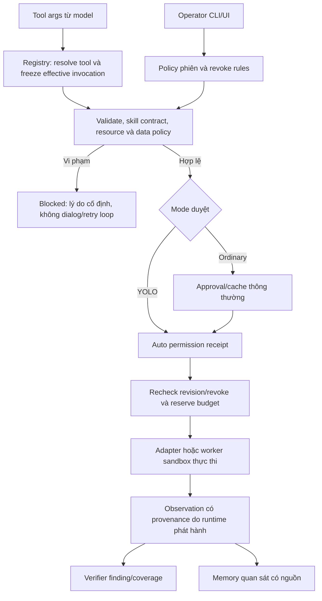

# Thiết kế khuyến nghị: YOLO tự duyệt mọi tool với policy độc lập

> **Trạng thái hiện tại:** thiết kế dưới đây là mục tiêu đầy đủ, không phải toàn bộ
> đã thực hiện. [REPAIR.md](REPAIR.md) đối chiếu implementation bổ sung: scoped
> plaintext HTTP worker, fresh local stdio MCP, narrow SQL verifier và human proof
> review đã có; actor/export, raw network và autonomous all-class vẫn thiếu.

Ngày 02/10/2026. Đề xuất, chưa triển khai. [Audit](REPORT.md) và [acceptance tests](ACCEPTANCE.md) là phần bàn giao đi kèm.

## 1. Quyết định chính

YOLO là **mode duyệt permission** của phiên. Bật bằng UI/CLI đáng tin tạo một execution profile phiên từ target/scope, workspace và integrations do operator xác lập. Profile bao phủ mọi tool đã đăng ký, trong đó resource boundaries được code/sandbox cưỡng chế. Không thêm bước `/permissions grant`, không dựa phase/method/keyword/nhãn model và không hỏi lại cho quyền đã bao phủ.

Mọi tool vẫn tồn tại và có thể thực hiện phép thử hợp lệ trong môi trường phù hợp. Vi phạm quyền trả blocked; thiếu dữ liệu thực để làm việc trả needs-input; thiếu environment enforcement trả enforcement-unavailable. Những trạng thái này không mở approval dialog tự động. Không tuyên bố full YOLO đã đạt khi một nhóm tool vẫn phải hỏi, bị tắt hoặc không thực hiện được các benign controls trong ma trận.

Tắt YOLO gỡ auto-approval của mode, quay về cơ chế duyệt thông thường với quyền/caches operator đã cấp còn hợp lệ. Không tự xóa explicit deny/revoke. Phải ghi rõ manual autonomous grants hiện có vẫn là quyền operator độc lập; không được dùng chúng để giữ implicit quyền do YOLO tạo. Nếu operator muốn mọi protected action hỏi khi OFF, chọn baseline confirm-each trong cấu hình UI.

**Thay đổi có chủ đích so với M1:** requirement confirm-each là cách duyệt permission, nên YOLO ON không tiếp tục hỏi chỉ vì grant đang mang mode này. Giữ origin/data/budget restrictions và explicit denial của grant. Lưu chế độ duyệt cũ để OFF khôi phục. Một operator muốn review riêng một tool có thể chọn custom mode; UI không được gọi trạng thái đó là full YOLO. Không giữ một ngoại lệ hỏi ngầm khiến ON vẫn spam.

## 2. Policy phiên từ nguồn đáng tin

Tối thiểu `SessionExecutionPolicy`:

```text
session_id, engagement_epoch, policy_revision
approval_mode = ordinary | yolo
operator_source = CLI/UI event id (không lấy từ model/tool output)
target_origins, vetted network destinations + transport policy
network_roles = target | public_research | configured_oast | provider | integration
read_roots, write_roots, protected_roots, imported resource handles
credential_handles với actor + destination constraints
tool/server/executable identity và adapter generation
limits: session/operation deadlines, counters, rate, concurrency,
        request/response/output/process resource bounds
explicit_deny_rules, revocations, pending/suppressed issues
```

Policy trong controller runtime, không đọc lại file authorization mà model/shell có thể sửa. Snapshot operator config lúc toggle/startup; disk config/skill/executable đã đổi không được âm thầm nhận quyền cũ. Không deserialize quyền từ summary, intelligence hay raw tool args. Model fields giống `approved`, `risk=low`, `is_test` chỉ là data.

Profile mặc định khi operator bật YOLO: target origins hiện có; approved lab workspace và payload/wordlist/skill resources hiện có; artifact/scratch write roots; configured integrations trong worker; configured public research/OAST roles; finite limits hiện có hoặc operator-selected scan profile. Không tự cấp quyền toàn home/ổ đĩa, provider keys, browser profile cá nhân hoặc token của các integrations khác. `/permissions` chỉ xem, điều chỉnh và revoke; cấu hình profile là tùy chọn, không là bước bắt buộc cho lab thông thường.

Trusted runtime/code/control-plane roots phải read-only đối với worker; lab workspace tách khỏi code đang chạy KAgent. Khi workspace trùng repository KAgent, protected runtime roots có ưu tiên cao hơn broad workspace write. Các PoC/patch/source operations hợp lệ được làm trong lab checkout/scratch hoặc resource root operator đã xác lập, không cho target data tự sửa runtime để mở quyền. Không allowlist cố định endpoint, tên file hay payload: paths mới trong roots hợp lệ và endpoint mới trong origins hợp lệ tự chạy.

Unknown effects được operator chấp nhận cho disposable lab. Profile không có lời hứa test-only/bulk-delete-safe. Nếu lab chưa có adapter object identity thì không cung cấp narrow object guarantee. Environment provenance/operator lab declaration cũng không tự chứng minh backend thực sự disposable.

## 3. Pipeline chung, giữ Registry



Không bỏ `requires_permission` để bật YOLO: flag này đang được skill gate sử dụng; đổi nó có thể mở gate khác. Giữ Registry, nhưng policy check chạy cho cả `requires_permission=False` và direct/internal execution. Native HTTP đang có gate ở run và registry authorization interface là nền để mở rộng; các executor khác cần protected adapter/broker entrypoint tương ứng. Adapter map từ trusted class/registration code, không từ tool description hoặc remote schema.

Freeze **effective invocation** gồm args, normalized URL/headers/body, rewritten shell command, binary/argv/stdin, cwd/env profile, config digest, server/remote tool/session generation và options. Preview và dispatch dùng cùng object. Plugin cfg mutation probe là acceptance phải chuyển sang freeze hoặc invalidate, không chỉ deepcopy args.

Receipt một lần, có deadline, bind session/epoch/policy/config/resource revisions và invocation digest; không log secret raw. YOLO tạo receipt tự động sau policy check. Ordinary approval chỉ được dùng cho invocation đã preview. Reserve limits và check revoke atomically ngay trước dispatch trên runtime owner; workers dùng broker tokens, không tự mint receipt hoặc quota. Không claim distributed atomicity nếu chưa có shared owner/store.

Independent hard checks không được override bằng ALLOW: out-of-scope origin/root, unauthorized data export, revoked tool/resource, invalid proof, stale/replayed receipt, unknown process environment. Ordinary operator muốn đổi quyền phải dùng trusted UI/CLI intent update; proposal bị chặn không tự bật hộp thoại để broaden scope.

## 4. Hành vi bật/tắt YOLO được đề xuất

| Hành động | ON | OFF | Enforcement luôn chạy |
|---|---|---|---|
| HTTP mới, SQLi/XSS/login/auth-IDOR/mutations trong lab | Auto, 0 approval | Exact approval/manual rights theo baseline | Origin, credential destination, budget, resource/data policy; không phân loại method |
| Discovery native/ffuf/nmap đúng target | Auto, 0 approval | Ordinary approval/cache | Prepared target/IP/ports/argv, shared counters, worker rights |
| Fetch target và search public được profile bao phủ | Auto, 0 approval | Gates ordinary; public search không thêm dialog nếu baseline không yêu cầu | Role target/research, redirects/DNS, data export, cache provenance |
| File/grep/evidence trong read roots, artifact/source edit trong write roots | Auto, 0 approval, giữ bytes/payload | Existing ordinary approval rules | Root/handle identity, confinement, provenance, protected roots |
| Sensitive lab input đã thuộc approved resource/credential profile | Auto, 0 approval | Existing sensitive approval | Read khác export; credential handles; no raw provider keys vào context |
| Shell/Bash, plugin, MCP trong approved worker/server scope | Auto, 0 approval cho command/args mới | Exact approval như hiện tại | Sandbox/broker/adapter và receipt identity; không command keyword allowlist |
| File/secret/network ngoài quyền hoặc explicit revoke | Block, 0 approval | Block; đổi policy chỉ bằng operator action | Rule/resource reason; không implicit retry |
| Finding/coverage có verified observations hợp lệ | Ghi tự động | Existing ordinary gate nếu có | Eligibility/class verifier/correlated observations, không tin outcome model |
| Finding giả, coverage claimed tested nhưng chưa chạy | Block hoặc lưu candidate/unverified | Tương tự | Independent result contract, không dialog |
| Memory/learning từ target | Lưu observed/untrusted có nguồn tự động | Tương tự | Không promote thành trusted directive hoặc operator permission |
| ask_user để xin lại permission đã bao phủ | Không tạo permission question | Ordinary permission UI | Policy query từ runtime; skill text/help cần đồng bộ |
| ask_user thiếu test account/OTP/thông tin thật | Có thể needs-input một lần | Tương tự | Không tự bịa câu trả lời; đây là yêu cầu thông tin, không approval spam |

Các limits phải là operator profile với thông số scan phù hợp; 500/20min/3s hiện tại chỉ là default ban đầu, không phải security constant tối ưu. Có thể nới mà không bỏ origin/deny/provenance controls. Giới hạn là containment vòng lặp/tải, không chứng minh request an toàn hoặc tiến triển. Per-operation counters của discovery và per-call timeout không được reset shared engagement quota.

## 5. Adapter/network và generic execution

### Native HTTP, discovery và web

Dùng chung authority/budget owner cho HTTP/fetch/discovery; web search đi role public_research độc lập với attack target scope nhưng vẫn thuộc data policy. Hạn mức nguồn và đích được đối chiếu trước send, kể cả lần follow redirect và mỗi outbound request từ scanner. Cache reuse ghi cached_from_observation, không tạo timestamp proof fresh hoặc bỏ qua policy mới.

Resolve/vet IP trước dispatch; bind actual destination/SNI/Host, IPv4/IPv6 và DNS policy vào execution. Service discovery đã pin numeric address là điểm tái sử dụng; HTTP/content/ffuf cần pin transport hoặc broker/proxy có enforcement. Không coi proxy env/Burp là enforceable sandbox. Giữ Burp interception bằng operator-configured proxy path và quyền riêng; proxy phải enforce actual destinations hoặc worker không có đường network trực tiếp. Private lab target do operator xác lập được tự chạy dưới ON; private host khác, metadata hoặc rebinding vượt vetted policy bị block không hỏi.

Search provider redirects/dependencies là profile research role, không tự mở attack scope. OAST/callback endpoints từ trusted config được role phù hợp; URL target đưa ra không được tự thêm role. Request/budget accounting phải nhìn actual requests/connections, không chỉ đếm một shell tool call hoặc một scanner operation.

### Shell/plugin/stdio MCP

Arbitrary commands được chạy trong worker VM/container/OS sandbox, không phải lọc shell text. Mount read roots read-only, write roots riêng, không host home/credential store/agent control plane hoặc docker socket; chỉ network qua broker; giới hạn process tree, CPU/memory/disk/output/time và kill/cancel theo execution handle. Environment không tự kế thừa keys của KAgent; cấp credential handle hoặc minimum per-server credentials.

Windows/WSL process group, cwd, timeout, denylist, `Path.resolve` và đặt proxy env không đủ làm sandbox. Phải kiểm actual OS/VM isolation trên nền tảng đang chạy, gồm escape qua symlink/hardlink, child/background process và direct sockets. Local MCP server cần launch **ngay từ đầu** trong worker, không chạy unsandboxed rồi chỉ sandbox RPC tool wrapper. Browser phải dùng profile lab riêng, network broker và version/source identity đã kiểm chứng.

Code broker không được tin binary basename hoặc server name là dấu hiệu safety. Pin executable/package/config/tool definition identities và generation; model không được sửa chúng qua file_write/learning. Dynamic endpoint/payload/commands vẫn được tự chạy trong worker scope. Các resource mounts/broker permissions là contract, không endpoint allowlist hoặc shell keyword classifier.

### MCP upstream

Code hiện chủ yếu stdio; thêm remote/upstream không biến sandbox client thành enforcement cho máy server. Trusted adapter phải biết account/project/resource identities và credential scope do server thực sự enforce, hoặc server nằm trong môi trường lab disposable/harness. Generic RPC JSON có thể che toàn bộ behavior; metadata/hash chỉ chứng minh tool identity/schema, không chứng minh tác động thực.

Nếu chưa có cơ sở cưỡng chế, trả `enforcement-unavailable` với requirement rõ ràng và một thông báo; không gọi user approve từng request để giả lập sandbox. Đây là khoảng trống triển khai phải giải quyết, không là cách tắt tool vĩnh viễn để coi yêu cầu full YOLO đã đạt. Release full mode cần chạy thành công benign controls của tất cả configured tool groups.

## 6. Dữ liệu: quyền đọc và quyền xuất khác nhau

Runtime gán provenance và quyền xuất cho resource handles/observations, không lấy nhãn model. Target responses vẫn untrusted về instructions; confidentiality riêng với trust. Tách source labels: target observation, approved lab input, local restricted, credential handle, operator control event. Sink gồm HTTP URL/query/headers/body, search query, MCP/plugin stdin, browser navigation/OAST, artifacts, log/report, memory và model-provider context.

Broker chỉ xuất data class tới destination role được policy bao phủ. Payload/wordlist/test-source có quyền dùng trong lab được giữ nguyên, kể cả có SQLi/XSS hoặc câu prompt-like. Target data độc hại vẫn lưu/raw inspect như observation; không xóa response hoặc filter keyword để làm test pass.

Provider/API keys của KAgent không vào model-visible workspace/environment. Login/session tests dùng handles của test actors, runtime consume token theo destination/actor bounds; không model copy token của integration khác. Operator import lab evidence/source tạo handle theo UI/profile hiện có, không requiring per-request manual grant.

**Giới hạn quan trọng:** sau khi restricted bytes đã đi vào cùng LLM context có quyền gửi arbitrary strings, kiểm tra exact string/redaction hoặc metadata trên một tool arg không chặn mọi encoding/paraphrase/channel. Cần không đưa restricted bytes vào lane có network quyền đó, hoặc tách worker/context theo data domain và có trusted release procedure. Coarse context-wide taint có thể overblock SQLi/XSS/auth; không đưa nó vào bản nhỏ như một bảo đảm hoàn chỉnh. Full design cần paired tests cho export và legitimate payloads. Unknown secret ẩn trong allowed project file cũng không thể tự phân loại chính xác chỉ bằng tên/keyword; profile data assumptions phải công khai.

File/evidence adapters recheck opened handle/root identity chống traversal/symlink/TOCTOU trong khả năng OS; snapshot/copy giữ source/confidentiality. Known metadata absent trong legacy proof không tự coi public/trusted. Quarantine ở mức provenance/trust không xóa dữ liệu proof hợp lệ; yêu cầu re-import/verification khi muốn dùng cho confirmed facts.

## 7. Observation, finding và coverage

Execution broker phát hành observation id bất biến với session/epoch, invocation digest, actual destination, actor, source adapter, time, result/status/body hash, capture/parent chain, cached flag và verifier inputs. Worker/model không tự ghi hoặc sửa authoritative ledger. File_write có thể tạo proof text nhưng không mint observation. Checksum hiện tại tiếp tục bảo vệ artifact integrity.

Finding phải gắn candidate + class + endpoint/parameter/actor với runtime observations, verifier contract và phiên phù hợp. SQLi boolean/time có request/response/timing repetitions thực thay vì model tự điền signatures; error-based SQLi giữ flow hợp lệ nhưng contract không được chỉ trust model technique. XSS cần source-sink/browser canary evidence từ trusted capture khi contract đòi execution; IDOR cần actors/object ownership và comparison thực; auth cần chain session/cookie transitions. Browser/MCP/shell evidence dùng adapter/capture chain tương ứng, không loại bỏ external proof chỉ vì không native HTTP.

Verifier chưa hỗ trợ một class thì có thể lưu candidate/evidence/unverified report; không tự ghi confirmed vì proof không rỗng. Severity/impact narrative phải khớp observed facts theo class contract; untested potential impact được ghi điều kiện. Observation của target-controlled response chứng minh đã nhận bytes, không chứng minh server nói thật hoặc exploit objective truth. Independent app harness/capture có thể tăng bằng chứng; không hứa hết false positive.

Coverage tested chỉ từ attempted/performed observations phù hợp endpoint/parameter/class; negative phản ánh test đã thực hiện trong phạm vi, không kết luận app safe. skipped/blocked/unavailable không counted tested; giữ reason và khả năng whole-target kế hoạch bỏ bước không khả dụng theo trusted capabilities. Phase coverage của discovery do adapter kết quả phát ra, không model tự đánh dấu performed. Cleanup state từ cleanup operations/harness; model claim deleted không chứng minh dữ liệu đã dọn.

## 8. Compact/resume và learning

Persist typed facts với origin/observation/verifier ids; model summary giữ dưới dạng derived observation. Không nâng summary objectives/commands/todos thành operator directives hoặc confirmed results. Recalled content được render dưới vai trò/data framing thích hợp; provenance chạy qua structured/unstructured compact và @file mentions. Prompt guidance chỉ là một lớp, runtime policy không lấy quyền từ context.

Tự learning tạo project-scoped draft/observed lessons kèm evidence refs, không auto nâng decisions từ target/summary thành user preference hoặc copy sang personal trusted scope. Trusted user preferences đến từ operator-origin UI/direct instruction event; attached/quoted target content không được promote chỉ vì nằm trong user message. Personal/verified promotion từ trusted event hoặc deterministic fact verifier; model field `trust=verified` không được chấp nhận. Có cơ chế retract/invalidate record bị poisoning mà vẫn giữ raw evidence.

Resume lấy operator settings hiện tại để tạo policy mới; không phục hồi grant/receipt từ summary. Nếu explicit operator lựa chọn ON vẫn hiệu lực trong runtime hoặc invocation có --yolo, có thể tạo quyền mới trong profile; không restore old IDs/quota. Explicit deny/revoke của cùng engagement phải nằm trong trusted session policy journal, không chỉ summary; target/scope changes không tự xóa chúng. Sang engagement mới chỉ reset theo operator action rõ ràng. Những policy này cần phân biệt với current native manager reset behavior.

## 9. Deny/revoke, không hỏi lặp và không retry vô hạn

- `DENY_ONCE`: chặn invocation đang xét; không biến thành global session deny. Receipt/replay của nó invalid. Equivalent retries trong issue đang bị từ chối trả pending/suppressed đến operator explicit retry hoặc intent change; không dialog lặp.
- `REVOKE_RESOURCE/TOOL/SESSION`: durable explicit rule ưu tiên cả YOLO, cache, manual grants. Same engagement off/on, target edit, parallel queued work và resume không làm biến mất revoke; in-flight side effects không rollback.
- `CANCEL`: dừng invocation/queue/process tree nếu có; không tự retry hoặc đặt session deny. Timeout/network errors không có transport retry vô hạn; legitimate application-level retry dùng bounded retry context và fresh reserve. Không refund send-attempt quota khi không chắc request đã đến server.
- Pending issue key theo session/epoch, policy rule, capability/resource và operator intent revision. Cùng thiếu scope/permission/revoked resource với phase/wording khác không thêm dialog. Ordinary equivalent review được gộp; exact approval không dùng chung cho distinct invocations. Under ON dialog count phải bằng 0, kể cả nested gate.
- Rule/resource violations terminal, một thông báo trong transcript + status; model receives stable code/reason/remediation, không suggested repeated approval. Rate/concurrency có thể wait bounded/cancellable, terminal expiry/budget không loop refill. Identical request không bị tự dedup/block chỉ vì giống nhau: SQLi timing/boolean repetitions và auth comparison là benign controls bắt buộc.

Không có bộ suy luận đáng tin biết mọi shell command đổi whitespace/encoding còn mang cùng tác động. DENY_ONCE không hứa chặn mọi semantic equivalent command mới. Khi operator muốn chặn cả capability/resource, dùng revoke tương ứng. Runtime có thể giữ issue/action lineage, budgets và progress facts để chặn repeated blocked attempts, nhưng không dùng shell keyword hoặc model safety label để đoán ý nghĩa.

Skill help phải dùng query tới runtime policy cho authorization checkpoints đã được operator profile bao phủ; bỏ các chỉ dẫn xin lại permission cho cùng authorized work dưới ON. Giữ tool allowlists, evidence requirements, cleanup, stop conditions và thông tin tài khoản chưa có. Không blanket auto-answer `ask_user` hoặc coi lời model là approval.

## 10. Lộ trình từng bước nhỏ

| Bước | File/module dự kiến | Kết quả riêng và tiêu chí dừng |
|---|---|---|
| P0: Chốt contracts và baseline | audit matrix/fixtures, UI wording | Phân biệt autoapprove và execution rights; review acceptance. Chưa đổi full YOLO |
| P1: Policy/receipt/issue owner chung | permission, Registry/types, engagement, bridge/UI/CLI | Mode ON tự duyệt sau policy check; freeze config/identity; explicit denies/revoke; all paths including non-permission/direct calls; không publish full mode trước adapter coverage |
| P2: Native network adapters | HTTP, discovery, web, capabilities/private-host | Shared authority/budget, DNS/redirect/cache data-role checks; giữ scanner argv/payload/login/endpoint discovery; deny không đi đường fetch/search/discovery |
| P3: FS và process/MCP environments | file/search/evidence/mentions, shell/plugin, MCP startup/session | Roots/data handles, broker credentials, OS worker enforcement và identity; generic tools chạy benign flows 0 dialogs. Nếu môi trường chưa enforce, report limitation và chưa công bố full YOLO |
| P4: Observation/result contracts | workflow/evidence/finding/coverage/capture adapters | Source-correlated observations, class verifier, negative/cleanup facts; giữ imported shell/MCP/browser proof hợp lệ |
| P5: Compact/learning provenance | Agent, SessionStore, memory/intelligence, prompt/skill UI | Không trust summary/target lessons; resume policy journal; verified facts survives; quyền hiện tại do operator control |
| P6: Release full YOLO | acceptance suite + help/UI | Mọi configured tool group có allowed pentest 0 dialogs và blocked adversarial controls; không shadow model API calls hoặc hidden approvals |

P1 không phải lý do bật unrestricted shell/MCP trên host ở production. Các patch từng bước phải có before/after và paired tests; không giữ assertion current gap là đạt trong security acceptance. Không triển khai tất cả trong một lần.

## 11. Đánh đổi còn cần chốt trước coding

Khuyến nghị một default disposable-lab profile, worker tách host, roots từ operator workspace và network roles từ existing trusted config; finite limits có thể tùy chỉnh. Cần chốt platform isolation (Windows VM/WSL/container/OS mechanism thật), remote MCP trust/enforcement contracts, source export domains, supported class verifiers và deny journal lifetime. Những lựa chọn này không cần approval từng request nhưng quyết định bảo đảm thực tế.

Full YOLO có thể đảm bảo không hỏi permission trong flows hợp lệ **khi** environment và adapter contract đã được cấu hình/kiểm chứng. Nó không đảm bảo mọi proposed action đều được chạy, không thay thế xác minh app effects, không triệt tiêu model goal hijacking và không chứng minh chống tuyệt đối prompt injection.


## Kết quả sau triển khai — 02/10/2026 (bổ sung, giữ lịch sử phía trên)

Đã triển khai và kiểm chứng **một phần** thiết kế. Không công bố full YOLO:
MCP, network worker/scanner, data-domain/credential adapters và production
class verifiers chưa hoàn thành; những đường thiếu enforcement được giữ chặn.
Các mục trước phần bổ sung này là kết quả **trước sửa**, không phải mô tả code cuối.

Chi tiết file, hành vi ON/OFF, operator controls, hạn chế chức năng và ma trận
acceptance: [IMPLEMENTATION.md](IMPLEMENTATION.md),
[hướng dẫn runtime](../../../docs/yolo-execution-policy.md).

Kiểm tra offline cuối: **2.429 passed, 1 skipped** trong regression security/
tools/data/agent/UI/runtime/state/skills/browser; **7 passed** bổ sung cho native
YOLO không manual grant, phase không tự mở quyền khi OFF và common receipt hết
hạn. 7 case này được thêm sau regression và có output focused riêng, không
cộng trùng các lần rerun. Pyright toàn src/tests: **0 errors, 0 warnings**;
`git diff --check`: đạt. XML/check metadata ở
[implementation-results.xml](implementation-results.xml),
[implementation-focused-results.xml](implementation-focused-results.xml),
[implementation-verification.json](implementation-verification.json).

Loopback HTTP và worker Linux offline được kiểm bằng thực thi thật; model client,
upstream web/search và secrets dùng fixture/mock. Fixture verifier chỉ kiểm
contract, không được gọi là verifier SQLi/XSS/auth/IDOR thực. Bằng chứng trước sửa
`results.xml`, `test_current_boundaries.py`, baseline và ZIP vẫn giữ nguyên.

Checkpoint trước triển khai: `b1057dcf7de9478c1649a35612d3bebeb3824303` trên branch
`work/yolo-all-tools-2026-10-02`. Các sửa đổi triển khai chưa commit; không push,
reset/clean, cài dependency hay gọi model API. Scope/deny/limits khác auto-review;
grant rộng không chứng minh tác động ứng dụng an toàn. Test pass không chứng minh
chống prompt injection toàn diện. **L01/P6 chưa đạt**, các A/L partial và release
blockers được liệt kê rõ trong IMPLEMENTATION.md.


## Sửa bổ sung và startup — 02/10/2026, giữ kết quả lịch sử

Implementation hiện tại và ma trận acceptance chi tiết: [REPAIR.md](REPAIR.md).
Đã sửa managed evidence re-read với protected CLI roots; scoped plaintext HTTP
broker cho Linux shell/plugin/compatible fresh stdio MCP và ffuf; exact DENY;
discovery response cap; browser scope views; narrow production SQL boolean/JSON
verifier; protected historical result persistence; operator proof review có nhãn.
Startup worker dùng scratch `/tmp`, không quét project để chạy `/bin/true`; real
dispatch vẫn inspection fail-closed. Bỏ splash dwell cố định 5 giây.

Regression cuối chạy tuần tự: **2.692 passed, 1 skipped**, 2 malformed-config
fixture warnings; focused startup/guidance **184 passed**. Pyright src/tests:
**0 errors, 0 warnings** (chỉ có thông báo phiên bản mới, không cài). Diff check đạt.
Artifacts: `repair-2026-10-02/regression-final-serial.xml`, `startup-and-guidance.xml`,
`startup-timing.json`, `pyright-final.txt`, `repair-final-verification.json`.

Live lịch sử trước chỉ dẫn dừng: 1 session/4 DeepSeek attempts, native HTTP và
shell HTTP control thành công, 0 permission dialogs/manual grants. Missing usage
ở một helper response đã dừng sớm; upper accounting $0.004865112 gồm reservation,
không phải actual invoice. **Không chạy thêm live pentest/API trong lượt cuối.**

Chưa full YOLO: nmap/raw/CONNECT/remote hoặc persistent/env MCP, actor/export,
autonomous all-class positive/negative/cleanup completion, complete egress,
typed memory/retraction, all-route DNS, filesystem races, aggregate cgroups và
non-Linux sandbox chưa đầy đủ. 15 lớp chỉ kiểm human-review workflow; không được
coi là 15 auto verifiers. L01/A03/A15 và full A16/A17 chưa đạt. Không dùng số test
pass hoặc tên worker để tuyên bố bảo toàn mọi luồng/chống prompt injection toàn diện.
Không commit/push/reset/clean/cài dependency. Checkpoint HEAD giữ nguyên.
